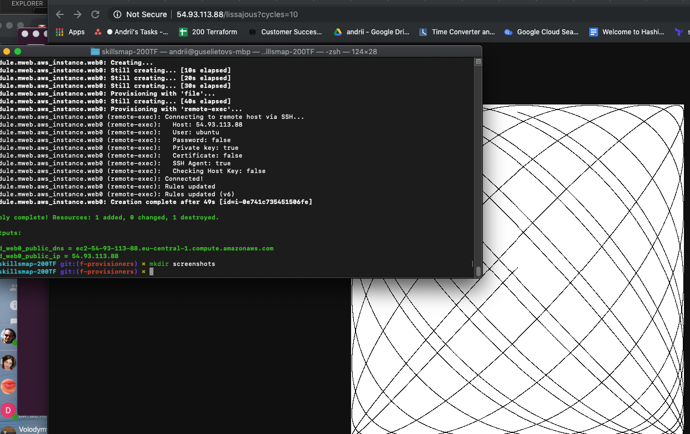

# skillsmap-200TF
Repos that follow training and tries in SkillsMap 200 Terraform 

# TODO 

- [ ] Follow along

# DONE
- [x] refactored example as a module
- [x] added provision of machine via module, with example go app for Ubunt 

# NOTES

1. All instances created during the set of this exercise are going to be marked with special tag :
```
learntag ="200tf"
```
